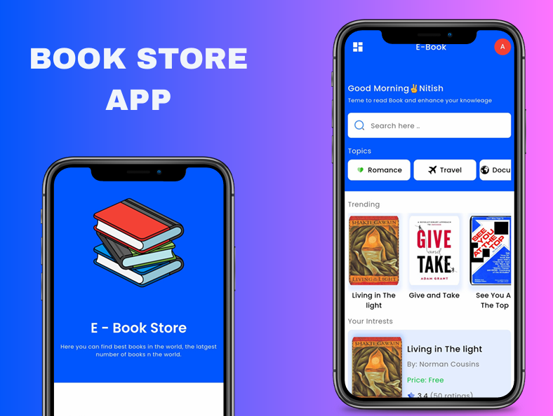

# 📚 Book Store App

A beautifully crafted Flutter application that showcases a modern and interactive digital bookstore experience. Designed with clean architecture, elegant UI, and seamless navigation, this app allows users to browse, preview, and interact with books in a delightful way.

---

## 🚀 Project Overview

The **Book Store App** is a cross-platform mobile application built using Flutter. It provides users with a curated collection of books, complete with detailed metadata, ratings, and visual previews. The app emphasizes performance, modularity, and a smooth user experience, making it ideal for educational, commercial, or demo purposes.

---

## 🛠 Tech Stack

- **Flutter** 3.6.1 — UI toolkit for building natively compiled apps
- **Dart** — Programming language for Flutter
- **GetX** — Lightweight state management and navigation
- **Syncfusion PDF Viewer** — Embedded PDF viewing
- **Flutter SVG** — Rendering SVG assets
- **Cupertino Icons** — iOS-style iconography

---

## 🧱 Architecture

The app follows a modular and scalable architecture:

- **MVC-inspired separation**:
  - `Models/` — Data structures (e.g., `BookModel`)
  - `Controllers/` — Business logic and state (e.g., `PdfController`)
  - `Pages/` — Screens and views
  - `Components/` — Reusable UI widgets
  - `Config/` — Theming and constants

- **State Management**: Powered by **GetX**, enabling reactive UI updates and simplified routing.

- **Asset-driven UI**: Uses local images, fonts, and SVGs for a rich visual experience.

---

## ✨ Features

- 📖 Browse books with cover images, titles, authors, and ratings
- 🔍 Filter books by categories (Romance, Travel, Documentary, etc.)
- 📄 View PDFs using Syncfusion’s embedded viewer
- 🎧 Audio metadata support (placeholder for future audio playback)
- 🌗 Light theme with custom typography and color scheme
- 📱 Responsive UI with Material Design principles
- 🔙 Custom back button and primary action buttons

---

## 🚀 How to Run the Project

1. **Clone the repository**  
- git clone https://github.com/a7med2002/Book-Store-App.git

2. **Install dependencies** 
- flutter pub get

3. **Run the app**
- flutter run

---

## 🖼️ Screenshots

---
## 📦 Download APK  

You can download the latest version of the **Book Store App** APK directly from Google Drive:  

👉 [**Download Book Store App (APK)**](https://drive.google.com/file/d/1F94wZRymed_w4ZSSDlai87SnPkBXGdsb/view?usp=sharing)  

---

## 🌐 Social Links

- 👨‍💻 Developer: [ِAhmed Meqdad]
- 📧 Email: [ahmd2002mqdad@gamil.com]
- 💼 LinkedIn: [linkedin.com/in/ahmed-meqdad](https://www.linkedin.com/in/ahmedmeqdad0)